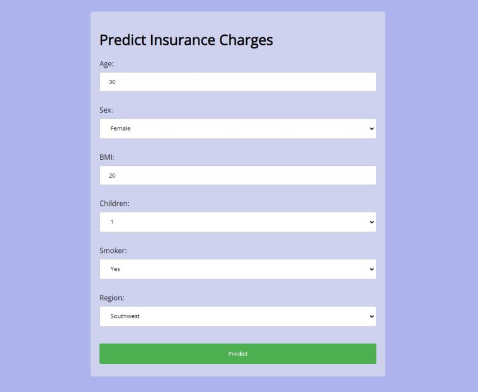

# Lesson 6: Insurance Claims Prediction

Simple Flask app for ML model predictions via (1) HTML Form (2) API requests.

## About This Repo

- Package dependencies can be found in `requirements.txt` file.
- Command to start Flask app: `python src/app.py`

## Acknowledgements

Dataset Source: Machine Learning with R by Brett Lantz ([codebase](https://github.com/stedy/Machine-Learning-with-R-datasets)|[book](https://www.packtpub.com/product/machine-learning-with-r-third-edition/9781788295864))
